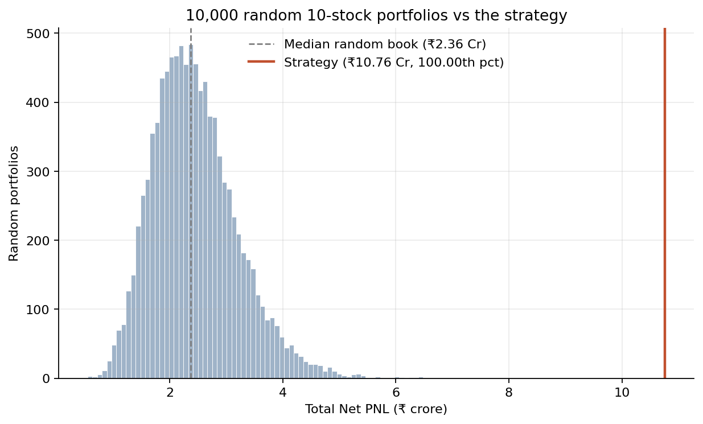
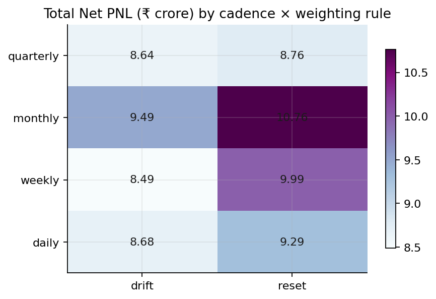
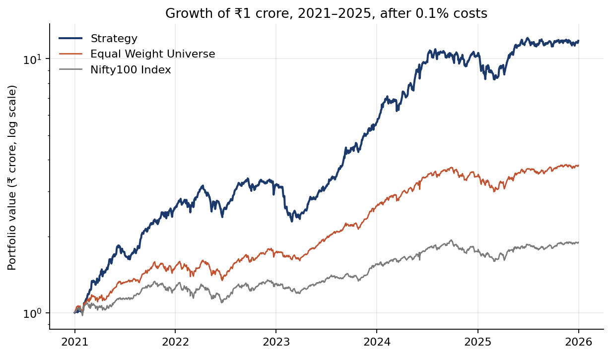
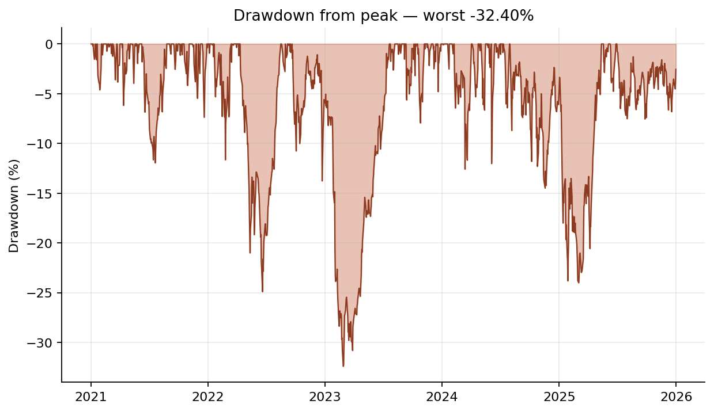

# How this project was explored, and everything we tried

**For a reader who knows finance, not this codebase.** Nothing here requires opening a
Python file. Every number is produced by the repo and can be checked in `output/`.

The short version: **we built the simplest possible momentum rule first, then spent the
project trying to beat it, and failed.** Fifty-nine distinct configurations were evaluated
across 63 backtest runs. The rule
that wins is the one we started with, rebalanced monthly instead of quarterly. This document
is mostly about the fifty-eight that lost, because that is where the evidence is.

---

## 1 · The problem, and what makes it awkward

The mandate: at most 10 stocks from the Nifty 100 and Nifty Midcap 100, ₹1 crore, 1 Jan 2021
to 31 Dec 2025, 0.1% costs, **ranked on Total Net PNL** — not on Sharpe, not on anything
risk-adjusted.

Three consequences drove every design choice.

**Risk reduction is a handicap here.** Under raw PNL, volatility is rewarded. Vol targeting,
regime gates and beta hedging all reduce the number they are scored on. We excluded them by
design and said so up front, rather than adding them for appearances.

**Ten names out of ~190 is mostly luck.** A 10-stock book carries roughly 12–15% annual
tracking error against its universe. Over five years that is a ±30–40 percentage-point
swing — wider than any alpha we could plausibly claim. So a strategy beating a benchmark
proves nothing on its own.

**That is why the noise band exists**, and it is the single most important thing in this
project. We generate **10,000 random 10-stock portfolios** through the *identical* engine —
same universe, same rebalance dates, same costs, same corporate-action handling — and record
where each lands. The only difference between a random book and ours is *which names get
picked*, so the spread of those 10,000 outcomes is pure luck.

Every change we ever made was then judged against one rule:

> **If a change moves PNL by less than the noise band, nothing has been found.**
> It is a resampling of luck.

The strategy's ₹10.76 crore against a median random book's ₹2.36 crore. **Zero of 10,000
random portfolios beat it.**

---

## 2 · How we worked

Four rules, adopted before any code, that shaped everything downstream.

**Every design decision was written down before it was implemented.** `docs/DECISIONS.md`
holds all of them — 61 entries, including the ones we rejected and, more usefully, the ones
we got wrong and reversed. A decision is anything where a reasonable person could choose
differently and the numbers would change.

**Every parameter lives in `config.yaml`.** No number is buried in a function. There is no
`get(key, default)` anywhere in the source, and a test greps for the pattern, because a
default in a getter is a design decision made in the dark.

**Every trial was pre-registered with its predictions before it ran.** Each slate below was
declared in `docs/PROJECT.md` §11 — the arms, the frame, the band it would be scored
against, and what we expected — *before* the first number existed. Then every prediction was
scored, including the ones that failed. This is the difference between a result and a
rationalisation, and it is why the failures in this document are quotable.

**Causality is tested, not asserted.** A test scrambles every price from the rebalance date
onward and requires the selected book to be unchanged — then scrambles the formation window
to prove the first test is not vacuous.

---

## 3 · The baseline, and the two data problems that nearly broke it

**V0** is the null model: 12-1 momentum, top 10, equal weight, quarterly, no buffer, no
optimiser, zero fitted parameters. Built end-to-end first so that everything afterwards is a
measured delta rather than an opinion.

It reconciles: the trade log explains the NAV to within ₹1, asserted on every run.

Two defects surfaced along the way, and both are worth reporting because of what they cost.

**A single stale bar was carrying half a headline result.** `2025-03-18` appeared in Yahoo's
data but was not an NSE trading session. Because the momentum lookback counts *positions*
(252 rows back), one spurious row slid the window start for every rebalance after it. Removing
it dropped the 2026 stress result from +15.48% to +7.69%. One bad row, half the number.

**Two demergers printed losses no holder ever suffered.** VEDL fell 62.6% overnight on
2026-04-30 and TMPV 40.2% on 2025-10-14 — both because shareholders received stock in a
spun-off entity that a price-only panel cannot see. NSE publishes no adjustment ratio, so we
sell before the ex-date and forgo the spun-off entity rather than book a fictional loss. The
off-by-one here is load-bearing: the ex-date's own *open* is already ex-entitlement, so
selling on the ex-date books the entire phantom loss. Scheduling the exit one session earlier
turned a weekly arm's 2026 result from +1.8% to +8.6%.

---

## 4 · The universe, which changed twice and was worth 488 percentage points

This is the largest single number in the project and it is not a strategy result.

We began by using **today's** index membership applied backwards to 2021 — the obvious
approach, and the one the original decision justified by claiming no historical list was
freely available. **That claim was false and had never been checked.** NSE publishes every
index change as a dated press release; 27 of them cover the scoring window. We rebuilt
membership properly, verified by rolling today's list backwards under three invariants that
break immediately if a release is missed.

| Same rule, same dates, same engine | Total Net PNL | Return | Equal-weight benchmark |
|---|---|---|---|
| Today's constituents | ₹8,76,46,846 | +876.5% | +284.9% |
| Point-in-time membership | ₹3,88,03,708 | +388.0% | +151.6% |

**Index-inclusion bias was worth 488 percentage points — more than half the headline.** The
strategy's edge over its *own universe* falls from +592pp to +236pp.

Then, on 2 September, the organisers confirmed the scored universe is **the constituents as
of today**. So the biased universe is the mandated one, and the point-in-time reconstruction
stopped being our rule and became our *measurement of what the mandated rule contains*. Both
run from a single config word (`universe.membership_mode`), so anyone can check the 488pp in
one edit.

**Be precise about what is forward-looking here, because it is easy to state carelessly.**
The universe list is chosen with knowledge of the future, in two separate ways:

1. **Index inclusion.** A stock is in today's Nifty 100 partly *because* it rose over
   2021–25. We are picking the top 10 momentum names from a list of companies already
   filtered for having done well.
2. **Survivorship.** Firms delisted, acquired, or dropped from the indices between 2021 and
   2026 are absent from today's lists entirely. The strategy is never offered them, so it can
   never be caught holding one on the way down.

**The strategy itself has no look-ahead.** The signal uses data strictly through t−1 and
fills at the next open, and a test scrambles every price from the rebalance date onward and
requires the selected book to be unchanged — then scrambles the formation window to prove
that test is not vacuous. *All* of the forward-looking content sits in the universe
definition the mandate specifies, and none of it is in the backtest machinery. That
distinction is worth stating carefully, because a reader who sees "forward-looking bias" may
otherwise assume the whole exercise is compromised.

**We report the mandated number and disclose what is inside it.** A figure that large,
computable with the code in the repo, and left unmentioned would be the most damaging
omission available.

---

## 5 · Everything we tried, in the order we tried it

Each block below is a pre-registered slate. All numbers are on the **mandated universe**
(today's constituents), which is what the submission is scored on.

The bar to beat: **V0 quarterly, ₹8,76,46,846**, with a noise band of **σ = ₹86,16,185**.

**The complete list — every one of the 63 runs with all its parameters and metrics — is in
[`output/report/configurations.md`](output/report/configurations.md)**, generated from the
artefacts rather than transcribed. The blocks below summarise it. Fifty-nine of the runs are
distinct configurations; the other four deliberately repeat one through a different driver
script, and all four reproduce the original to the rupee.

### 5a · Rebalance cadence × weighting rule — 8 cells

The only axis that paid. Two questions at once: how often to re-pick, and whether to reset
each position back to 1/10 or let winners run.

| Cadence | reset | drift | reset − drift | Sharpe (reset) | turnover p.a. | costs |
|---|---|---|---|---|---|---|
| quarterly (V0) | ₹8,76,46,846 | ₹8,63,77,499 | +₹12,69,346 | 2.21 | 3.77× | ₹8.85 L |
| **monthly** | **₹10,76,49,806** | ₹9,48,87,434 | +₹1,27,62,372 | **2.42** | 7.36× | ₹20.60 L |
| weekly | ₹9,98,94,149 | ₹8,48,68,962 | +₹1,50,25,188 | 2.33 | 16.20× | ₹45.19 L |
| daily | ₹9,29,46,976 | ₹8,68,09,592 | +₹61,37,384 | 2.26 | 37.03× | ₹88.71 L |

**The winner: monthly, reset. +₹2.00 crore over the quarterly baseline (+2.32σ).**

Three things to note.

**The cadence term is an inverted U, not a trend.** Rebalancing more often helps up to
monthly and hurts after. Faster than monthly starts trading against the momentum persistence
the strategy is harvesting.

**It is not bought with risk.** Sharpe rises 2.21 → 2.42 and max drawdown is flat at −32%.
Better still, the *risk-adjusted* percentile against the band rises from **62.97 to 96.01** —
monthly rebalancing does not merely take more risk to earn more, it earns substantially more
per unit of risk. That is the strongest single number we have.

**It is not a cost story.** Costs rise from ₹8.85 L to ₹20.60 L, immaterial against a ₹2.00
crore gain. But note the daily row: at 37× turnover the bill reaches ₹88.71 L, so the
project's old claim that "costs are irrelevant" is true at quarterly and monthly, not in
general.

### 5b · The momentum lookback and skip — 6 cells

We had frozen the 12-1 convention (252 days back, skipping the most recent 21) on day one,
from the published literature, and never tested it. That is the weakest position to be in
when a panel asks "did you check?".

So we swept it — and fixed the adoption rule *before* seeing any number: a cell replaces the
incumbent **only if it beats it by more than one full band σ**, because taking the argmax of
six correlated cells is fitting, not choosing.

PNL in ₹ crore, and the same cells measured in band σ against the incumbent:

| lookback | skip 0 | skip 21 | | z, skip 0 | z, skip 21 |
|---|---|---|---|---|---|
| 126 days | 7.36 | 8.65 | | −4.56 | −2.83 |
| 189 days | 8.93 | 8.39 | | −2.46 | −3.18 |
| **252 days** | 10.63 | **10.76** | | −0.17 | **best** |

**The convention we started with is the best cell of its own surface.** Nothing came within
a standard deviation; the adoption rule never had to be used.

Two predictions scored: dropping the skip costs almost nothing (−0.17σ, confirmed — so
short-horizon reversal is not doing measurable work in this universe), and shorter lookbacks
lose (confirmed at skip 0, **failed** at skip 21, where the 189-day cell fell below the
126-day one by 0.35σ — inside the band, and recorded as a failed prediction rather than
reworded).

This *strengthened* the zero-fitted-parameter defence rather than costing it. The claim is
now "the lookback was swept over six pre-registered cells against a band fixed in advance,
and the convention won outright."

### 5c · Adding Nifty Smallcap 100 — 2 arms

The guidelines permit all three indices. We had used two, by choice, and the backlog called a
universe tilt "the largest single PNL lever" — an assumption nobody had measured.

We added today's Smallcap 100: 299 scored names instead of 200, everything else identical,
its own 10,000-draw band from its own eligible set.

Both columns below are on the submitted monthly calendar, so the benchmark and the strategy
are measured over the same rebalance dates:

| | equal-weight benchmark | strategy PNL |
|---|---|---|
| Two indices | +280.55% | ₹10,76,49,806 |
| + Smallcap 100 | **+299.12%** | **₹6,37,38,800** |

*(At quarterly the same pair reads +284.90% → +307.11%, and the strategy still falls,
₹8,76,46,846 → ₹8,04,04,132. The direction does not depend on the cadence.)*

**The universe got better and the strategy got worse by ₹4.39 crore (−5.1σ).** That
combination rules out the easy explanations — it is not that smallcaps did badly, and it is
not costs.

The mechanism is one we had already measured from the other direction: a top-10-of-190 rule
is a knife edge, so anything that perturbs *which* names land in the top 10 is expensive.
Adding 100 high-variance candidates lets them win the ranking on noise and displace better
names. 12-1 momentum cannot distinguish a smallcap that ran because it is compounding from
one that ran because it is small and volatile.

The pre-registered prediction was that PNL would rise materially. It fell. Recorded as a
failed prediction, and the lever the backlog called largest turns out to point **down**.

*(One name, FORCEMOT, was excluded from this arm: a 41-session hole in Yahoo's history that
cannot be forward-filled without inventing prices. It ran hard in 2024, so the exclusion errs
against the arm.)*

### 5d · A three-feature composite signal — 4 arms

The most substantial thing we built, and it lost decisively.

The design was deliberate: **one feature per concept**, chosen from a 10-feature diagnostic
that measured correlations *before* any PNL was computed, so nothing was picked for
performance. Averaging six momentum variants would silently make a composite 60% momentum;
this avoids that.

| Feature | What it measures |
|---|---|
| 12-1 momentum | how much it rose |
| Information discreteness | *how* the rise arrived — smoothly, or in a few jumps |
| Drawdown from the 252-day peak | where it sits against its own high |

| Arm | PNL | vs V0 | Sharpe | Max DD |
|---|---|---|---|---|
| **V0** | **₹8,76,46,846** | — | **2.21** | **−32.5%** |
| `rm-solo` — residual momentum instead of 12-1 | ₹4,33,02,965 | −5.15σ | 1.86 | −31.1% |
| `tilt` — composite, 2/1/1 weights | ₹2,92,15,951 | −6.78σ | 1.34 | −34.2% |
| `buffer` — composite plus a 10/20 rank buffer | ₹2,87,88,342 | −6.83σ | 1.39 | −35.1% |
| `base` — composite, equal weights | ₹2,31,22,522 | −7.49σ | 1.19 | −33.9% |

**Every arm lost, and not narrowly.** More damning: the composite is worse on the
risk-adjusted metric *and* on the risk metric — Sharpe falls and drawdown gets worse — so
this is not a case of trading return for safety.

**PNL is monotone in the momentum weight.** Every unit of weight moved off the two new
features and onto plain momentum earned money. That is the cleanest possible statement that
the two additions were the problem.

**Why it failed, measured rather than guessed.** We replaced the two new columns with
*random* columns of the same rank distribution, 2,000 times. Most of the loss reproduces:
measured on the point-in-time universe, roughly **185 of the ~255 percentage points** lost is
what *any* two uninformative columns would have cost — the top-10 rule is a knife edge, and giving away even 20% of the ranking vote
costs 116pp. The features were not merely weak; the error was assuming equal weighting is the
neutral choice. On a knife-edge rule it is close to the most aggressive claim available.

**We checked it was not a bug before writing any of that.** The composite's book overlaps
V0's by 3.35 names out of 10, against 3.4 computed independently through a completely
separate code path days earlier.

### 5e · The composite's feature weights — 42 cells

Judging a whole axis on two weight vectors is exactly the single-point bias that a sweep
exists to remove. So we swept it: 7 weight vectors × 3 cadences × 2 weighting rules, all
against bands that already existed.

**0 of 42 beat the baseline in their own frame. 0 reached even +1σ**, against a null
expectation of about 7 on luck alone. The best of 42 (₹8.40 crore) is ₹2.37 crore short of
the submission. The full per-cell ledger is in `output/v1/wgt_summary.csv` — every
configuration, nothing omitted.

The sweep also overturned one of our own readings: dropping **information discreteness** helps
more than dropping drawdown, in **6 of 6 frames** — the opposite of what our forward-looking
correlation estimate predicted. That finding then replicated 6-of-6 on the other universe
too, so it now rests on 12 frames rather than 6.

---

## 6 · The result

**The submission: 12-1 momentum, top 10, equal weight, rebalanced monthly.**

| | Value |
|---|---|
| **Total Net PNL** | **₹10,76,49,806** (+1,076.5%) |
| Final portfolio value | ₹11,76,49,806 |
| CAGR | 63.78% |
| Sharpe | 2.42 |
| Max drawdown | −32.40% |
| Accuracy / gain-to-loss | 62.5% / 2.01 |
| Costs paid | ₹20,59,816 (7.36× turnover p.a.) |
| Equal-weight universe benchmark | +280.55% |
| Nifty 100 benchmark | +89.4% |
| **Random 10-stock books it beats** | **10,000 of 10,000** |
| **Risk-adjusted percentile** | **96.01st** |

**The out-of-sample check.** H1 2026, fresh ₹1 crore, nothing carried over: **+7.60%** against
the equal-weight universe's +0.17% and the Nifty 100's −6.65%, at the 88.9th percentile of a
fresh band. This was used **only** as a one-way rejection filter — a candidate that collapsed
there would be dropped, but nothing was ever *selected* on it. Worth weighing accordingly:
six months and one market regime is one observation.

Longest-held names across the window: BSE (574 days), CGPOWER (534), GVT&D (511), ATGL (475),
RVNL (470). Full composition in `output/report/composition.md`.

---

## 7 · Things we got wrong and caught

Included because a project with no reversals in it has not been checked hard enough.

**A published conclusion was reversed twice by the data underneath it.** Whether to reset
weights to 1/10 or let winners drift flipped three times: reset won on today's constituents,
drift won point-in-time, reset won again on the mandated universe. **Both flips were caused
by the universe, not the weighting rule.** The honest reading is that trimming winners is
cheap precisely when your holdings were selected for having already run — which is what
today's-constituents membership guarantees. The rule is downstream of the universe, which is
not how weighting rules are usually discussed.

**Half a stress-test result rested on one bad row.** See §3.

**A premise was conceded without being checked**, and it cost 488 percentage points of
apparent performance. See §4.

**`weights.csv` was dimensionally wrong for the entire project.** It divided *share counts*
by NAV instead of position values, so a 10% position reported as 0.22%. Found while building
the report pack — by reading a number, not a chart. No reported figure was affected, and that
was verified rather than assumed: PNL is identical before and after the fix. It survived
because it was the one artefact in the repo with **neither a consumer nor an assertion**.
Everything else either reconciles against something or feeds a number someone looked at.

**A cold data fetch was broken for five days.** A constituent-count assertion started
comparing against the wrong total when the universe was rebuilt. Nobody noticed because
snapshots are immutable, so the code path had not run. Found in the final audit and fixed.

---

## 8 · This maximises the score. It is not what you would run with real money.

The mandate ranks on **Total Net PNL** — not Sharpe, not anything risk-adjusted. That single
fact drove the design, and it should be owned rather than left for a jury to raise.

**What the metric rewarded, and what we therefore built.** Volatility is rewarded under raw
PNL, so risk reduction is a handicap. We excluded vol targeting, regime gates and beta
hedging **in writing, before building anything**. The result holds 10 names, fully invested,
with no stop-loss and no drawdown control, and takes a **−32.4% maximum drawdown** as a
direct consequence. Concentration is the same trade: we measured that a median random
10-stock book earns roughly what the equal-weight universe does, so holding 10 names buys
*dispersion*, not expected return. In a PNL-ranked competition, wide is good. For someone's
actual savings, wide is the problem.

**What a live book would need instead:**

| Concern | What we did | What a live book would do |
|---|---|---|
| Drawdown | Accepted −32.4% | Position limits, a drawdown circuit-breaker, or a vol target |
| Concentration | 10 names, 1/10 each | Sector caps and a larger book |
| Costs | 0.1% per trade, as specified | Model STT, stamp duty, exchange fees, GST and slippage separately |
| Signal | One factor, unhedged | Diversify across factors; watch for factor crowding |
| Regime | None — always fully invested | Momentum crashes hard on sharp reversals |

**One practical objection does *not* stand, and we have the number.** Liquidity. Measured
against each name's 20-session average daily rupee volume, **99% of the 758 executions are
under 1.82% of that name's daily volume**, and the median is near zero — most monthly trades
are small resets back to 1/10 rather than full entries. At ₹1 crore, market impact is
negligible. (`output/report/numbers.md` §5.)

So the honest summary: **this configuration was selected to maximise the metric the
competition scores, on a universe the competition specifies.** Both choices inflate the
number relative to what a live, risk-managed book would have earned. Both are stated here
rather than left to be discovered.

## 9 · What we deliberately did not do

**No optimiser.** At 10 names, an estimated covariance matrix is mostly noise, and the metric
rewards return rather than efficiency.

**No regime filter or risk overlay.** Days in cash are forgone PNL under a raw-PNL metric.
The −32.4% drawdown is the visible cost, accepted rather than engineered away.

**No machine learning in the submitted strategy.** A tree ensemble was in the backlog and was
dropped: it needs a walk-forward and a look-ahead defence to search a feature space that
three hand-picked features had just failed in.

**No tuning against the 2026 window, ever.** It is a rejection filter, never a selection
criterion. Note that the *quarterly* baseline actually scores better in 2026 than the cell we
submitted — and we submitted the monthly cell anyway, because it won on 2021–25, which is the
window the rule says decides.

---

## 10 · Where to look

| What | Where |
|---|---|
| Charts | `output/figures/` |
| Every required metric | `output/report/numbers.md` |
| Portfolio composition and weights | `output/report/composition.md` |
| **Every configuration tested — all 63 runs, one table** | `output/report/configurations.md` |
| The narrative trial ledger, with predictions scored | `docs/PROJECT.md` §11 |
| Handoff pack for whoever writes the report | `docs/REPORT_OUTLINE.md` |
| Every design decision, including reversals | `docs/DECISIONS.md` |
| Mechanism arguments and bug hunts | `docs/NOTES.md` |
| How to reproduce all of it | [`README.md`](README.md) §4 |
